This is a [Next.js](https://nextjs.org) project bootstrapped with [`create-next-app`](https://nextjs.org/docs/app/api-reference/cli/create-next-app).

## Getting Started

First, run the development server:

```bash
npm run dev
# or
yarn dev
# or
pnpm dev
# or
bun dev
```

Open [http://localhost:3000](http://localhost:3000) with your browser to see the result.

You can start editing the page by modifying `app/page.tsx`. The page auto-updates as you edit the file.

This project uses [`next/font`](https://nextjs.org/docs/app/building-your-application/optimizing/fonts) to automatically optimize and load [Geist](https://vercel.com/font), a new font family for Vercel.

# -01-setup-environment-react
## Laporan Praktikum

|  | Pemrograman Berbasis Framework 2025 |
|--|--|
| NIM |  2241720115|
| Nama |  Alhamdana Fariz Al Furqaan |
| Kelas | TI - 3B |

### Pertanyaan Praktikum 1
1. Jelaskan kegunaan masing-masing dari Git, VS Code dan NodeJS yang telah Anda install pada sesi praktikum ini!
    - Git\
        Sebuah sistem kontrol versi terdistribusi yang digunakan untuk mengelola berkas serta mencatat perubahan yang terjadi pada setiap versi. Git memungkinkan kolaborasi dalam pengembangan perangkat lunak, memudahkan pengembang untuk melacak, mengembalikan, dan mengelola perubahan kode secara efisien.
    - VS Code\
        Sebuah kode editor yang dikembangkan oleh Microsoft. VS Code menyediakan berbagai fitur seperti debugging, kontrol Git, integrasi terminal, serta dukungan untuk berbagai bahasa pemrograman melalui ekstensi. Editor ini ringan namun memiliki kemampuan yang kuat untuk pengembangan perangkat lunak.
    - NodeJS\
        Sebuah runtime JavaScript berbasis Chrome V8 yang memungkinkan pengembang menjalankan JavaScript di luar browser. NodeJS sering digunakan untuk membangun aplikasi server-side karena kemampuannya dalam menangani permintaan secara asinkron dan efisien, terutama dalam pengembangan aplikasi berbasis jaringan seperti API dan layanan web.
2. Buktikan dengan screenshoot yang menunjukkan bahwa masing-masing tools tersebut telah berhasil terinstall di perangkat Anda!
- Git
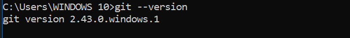
- VS Code
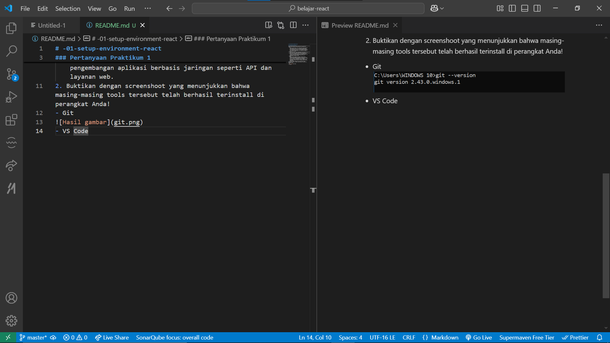
- NodeJS
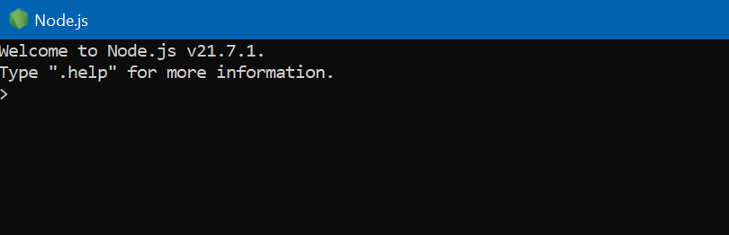

### Pertanyaan Praktikum 2
1. Pada Langkah ke-2, setelah membuat proyek baru menggunakan Next.js, terdapat beberapa istilah yang muncul. Jelaskan istilah tersebut, TypeScript, ESLint, Tailwind CSS, App Router, Import alias, App router, dan Turbopack!
    - **TypeScript**: Superset JavaScript yang menambahkan static typing, membantu menangkap error lebih awal dan meningkatkan maintainability kode.
    - **ESLint**: Alat linter yang memastikan kode tetap rapih, bebas bug, dan sesuai standar dengan aturan yang bisa dikonfigurasi.
    - **Tailwind CSS**: Framework CSS berbasis utility-first yang memungkinkan styling cepat tanpa perlu menulis CSS kustom.
    - **App Router**: Sistem routing baru di Next.js 13+, berbasis folder dalam /app/, mendukung Server Components untuk performa lebih baik.
    - **Import Alias**: Mempermudah impor modul dengan menggunakan path pendek (misal @/components), menghindari path relatif panjang (../../).
    - **Turbopack**: Bundler modern super cepat, pengganti Webpack, yang mempercepat proses build dan hot reloading di Next.js.
2. Apa saja kegunaan folder dan file yang ada pada struktur proyek React yang tampil pada gambar pada tahap percobaan ke-3!
Berikut penjelasan kegunaan dari setiap folder dan file dalam struktur proyek   Next.js   pada gambar:  

    ### Folder dan Fungsinya    
    - `.next/` = Folder build yang dibuat otomatis oleh Next.js saat menjalankan `next build`.  
    -   `node_modules/`   = Berisi semua package dan dependensi yang diinstal via `npm install`.  
    -   `public/`   = Menyimpan aset statis seperti gambar, ikon, dan file lainnya yang bisa diakses langsung di URL (`/favicon.ico`).  
    -   `src/app/`   = Folder utama untuk   App Router   di Next.js 13+, tempat file halaman dan layout aplikasi berada.  

    ### File dalam `src/app/`    
    -   `favicon.ico`   = Ikon kecil yang muncul di tab browser.  
    -   `globals.css`   = File CSS global yang diterapkan ke seluruh aplikasi.  
    -   `layout.tsx`   = File layout utama yang digunakan untuk membungkus semua halaman dalam aplikasi.  
    -   `page.tsx`   = File utama untuk halaman utama (`/` atau homepage).  

    ###  File Konfigurasi dan Lainnya    
    -   `.gitignore`   = Menentukan file/folder yang tidak akan di-track oleh Git.  
    -   `eslint.config.mjs`   = Konfigurasi ESLint untuk memastikan kode tetap rapi dan bebas error.  
    -   `next-env.d.ts`   = File TypeScript otomatis yang dibuat oleh Next.js untuk mendukung typing.  
    -   `next.config.ts`   = File konfigurasi utama untuk Next.js, bisa digunakan untuk mengatur fitur Next.js.  
    -   `package-lock.json`   = File yang mengunci versi dependensi agar tetap konsisten di setiap instalasi.  
    -   `package.json`   = File utama untuk manajemen proyek, menyimpan dependensi, script, dan metadata proyek.  
    -   `postcss.config.mjs`   = Konfigurasi untuk PostCSS, sering digunakan untuk mendukung Tailwind CSS.  
    -   `README.md`   = Dokumentasi proyek (biasanya berisi petunjuk penggunaan dan setup).  
    -   `tailwind.config.ts`   = Konfigurasi untuk Tailwind CSS, bisa dikustomisasi sesuai kebutuhan proyek.  
    -   `tsconfig.json`   = Konfigurasi TypeScript yang mengatur aturan dan fitur TypeScript yang digunakan dalam proyek.  

3. Buktikan dengan screenshoot yang menunjukkan bahwa tahapan percobaan di atas telah berhasil Anda lakukan!
- Pembuatan proyek dengan perintah `npx create-next-app`
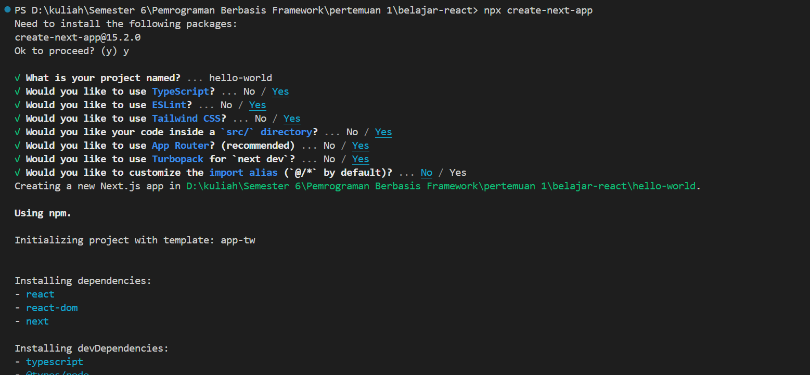
- Struktur folder proyek hello-world
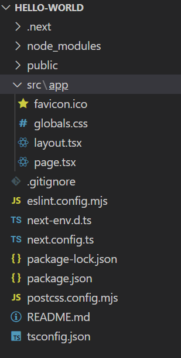
- Hasil run proyek dengan perintah `npm run dev` 
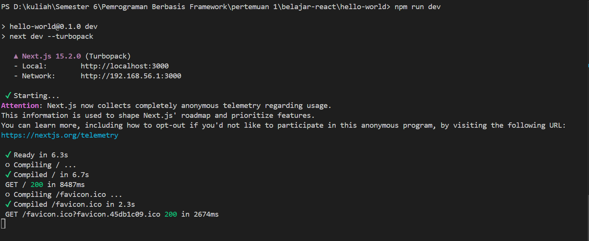
- Tampilan proyek
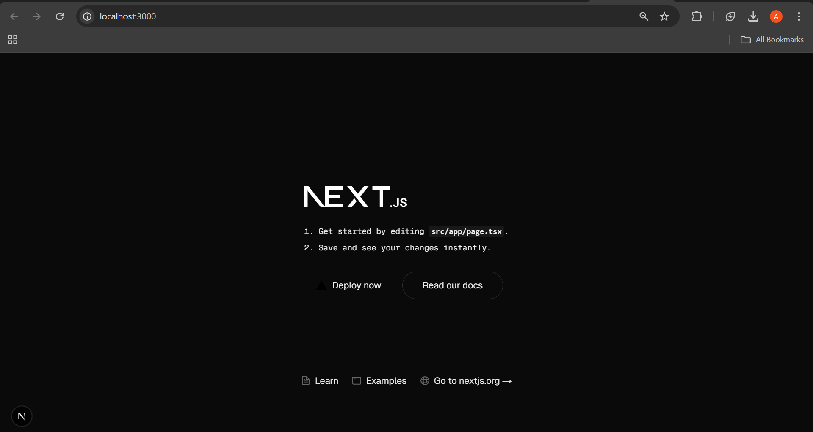

### Pertanyaan Praktikum 3
1. Buktikan dengan screenshoot yang menunjukkan bahwa tahapan percobaan di atas telah berhasil Anda lakukan!
- Penambahan kode
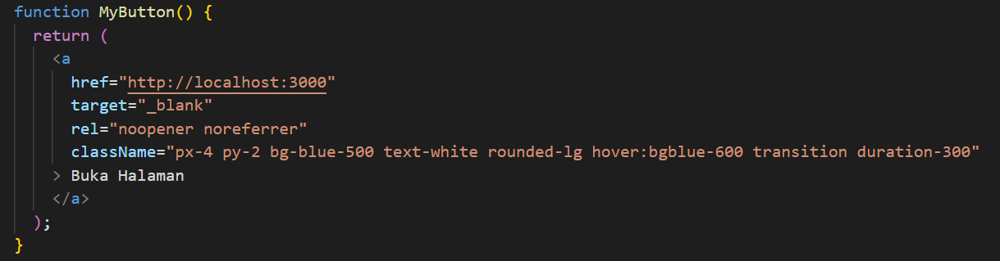
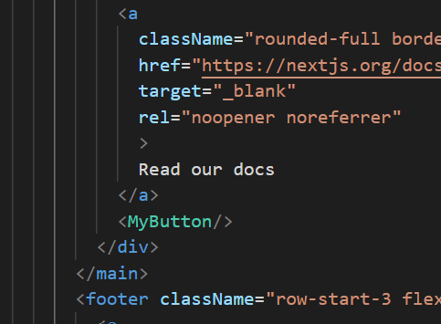
- Tampilan percobaan
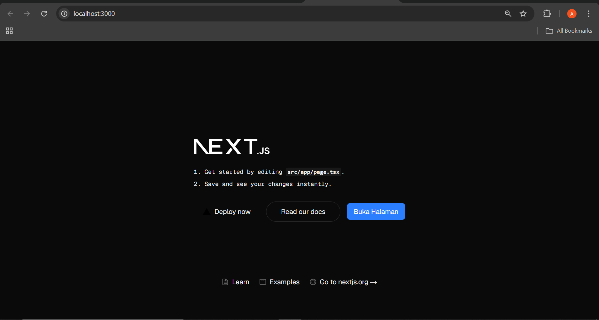

### Pertanyaan Praktikum 4
1. Untuk apakah kegunaan sintaks user.imageUrl?
- Untuk mengambil nilai dari imageUrl dalam objek user
2. Buktikan dengan screenshoot yang menunjukkan bahwa tahapan percobaan di atas telah berhasil Anda lakukan!
- Penambahan kode
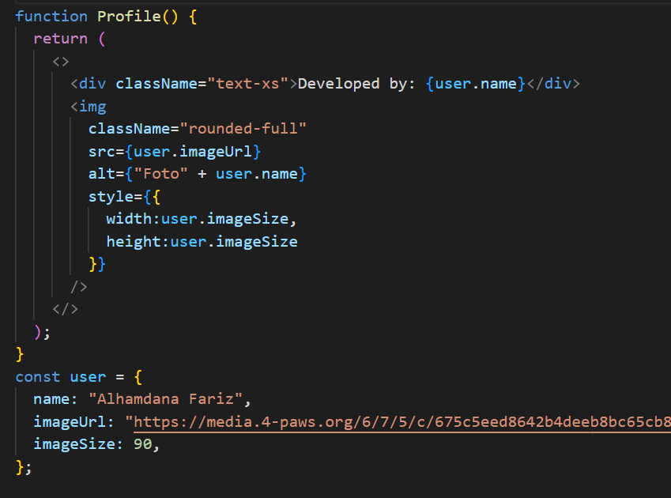
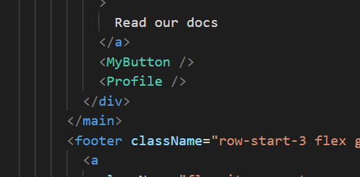
- Tampilan percobaan
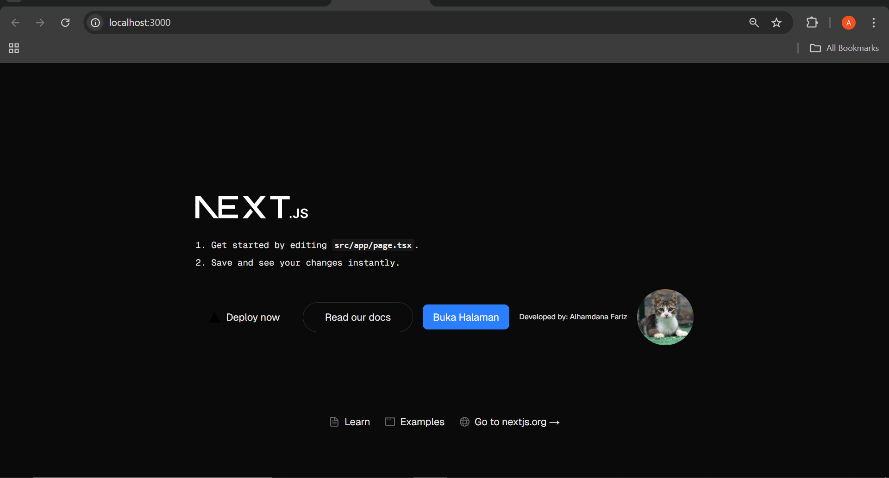
