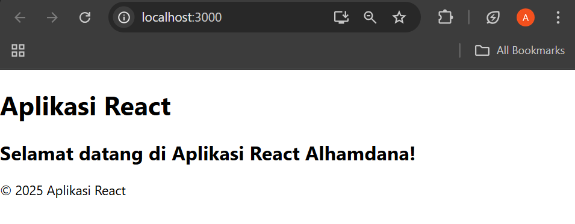
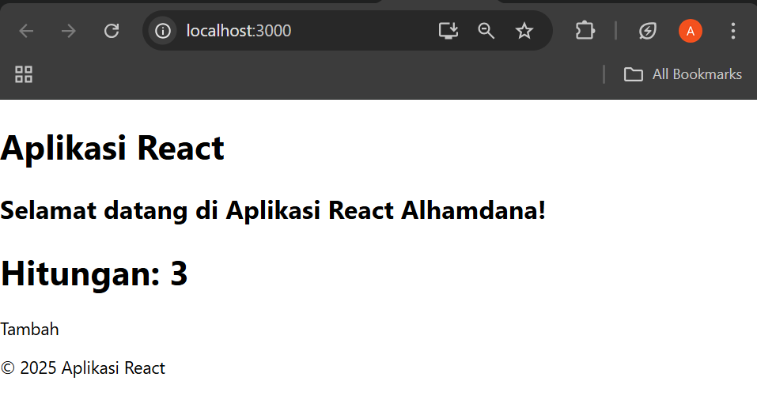
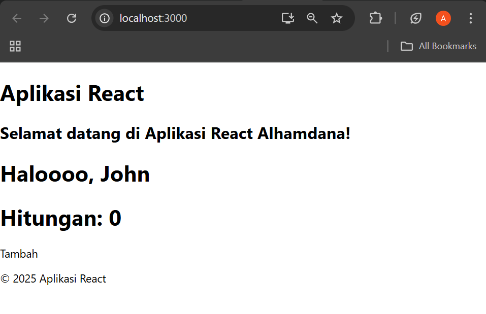
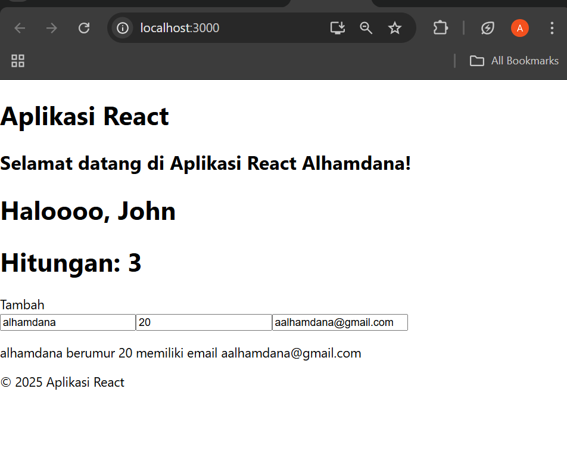
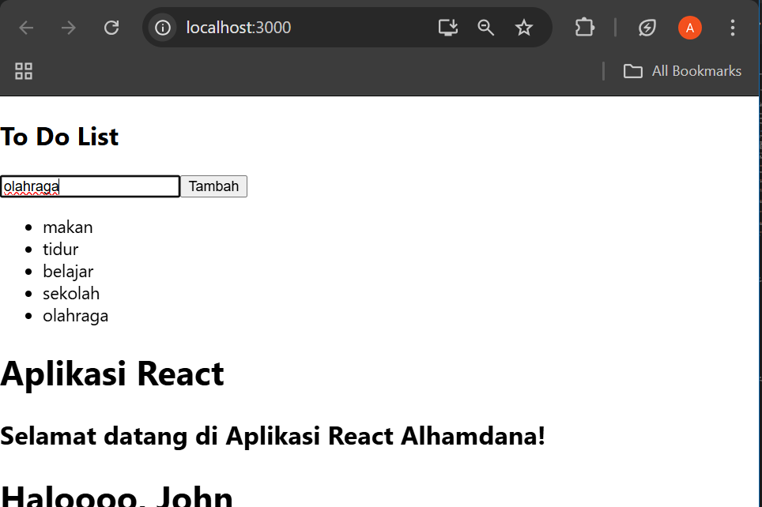
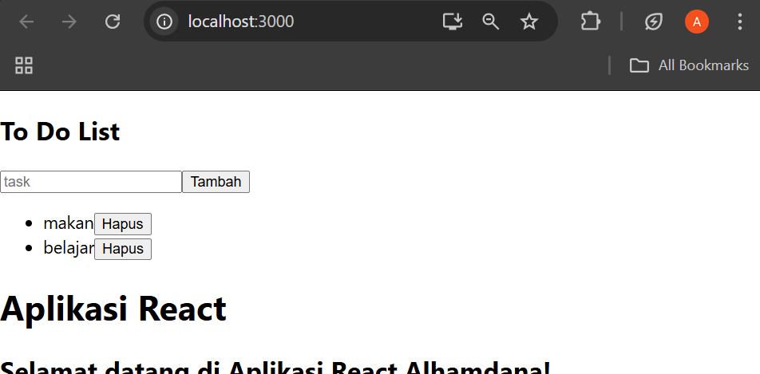

# Getting Started with Create React App

This project was bootstrapped with [Create React App](https://github.com/facebook/create-react-app).

## Available Scripts

In the project directory, you can run:

### `npm start`

Runs the app in the development mode.\
Open [http://localhost:3000](http://localhost:3000) to view it in your browser.

The page will reload when you make changes.\
You may also see any lint errors in the console.

### `npm test`

Launches the test runner in the interactive watch mode.\
See the section about [running tests](https://facebook.github.io/create-react-app/docs/running-tests) for more information.

### `npm run build`

# -02-Praktikum-2-React
## Laporan Praktikum

|  | Pemrograman Berbasis Framework 2025 |
|--|--|
| NIM |  2241720115|
| Nama |  Alhamdana Fariz Al Furqaan |
| Kelas | TI - 3B |

## Langkah-langkah Praktikum
1. Persiapan Lingkungan
2. Membuat Komponen React

3. Menggunakan JSX untuk Membuat Komponen Dinamis

4. Menggunakan Props untuk Mengirim Data

5. Menggunakan State untuk Mengelola Data



## Tugas
1. Buat komponen baru bernama TodoList yang menampilkan daftar tugas (todo list). Gunakan
state untuk mengelola daftar tugas dan props untuk mengirim data tugas ke komponen anak.
### ShowToDoList.js
``` javascript
import React from 'react'

function ShowToDoList({todo=[]}) {
  return (
    <div>
      <ul>
      {todo.map((item, index) => (
        <li key={index}>
            {item}
        </li>
        ))}
        </ul>
    </div>
  )
}

export default ShowToDoList
```

### ToDoList.js
``` javascript
import React, { useState } from "react";
import ShowToDoList from "./ShowToDoList";

function ToDoList() {
  const [todo, setTodo] = useState(['makan', 'tidur', 'belajar']); 

  return (
    <div>
      <h2>To Do List</h2>
      <ShowToDoList todo={todo} /> 
    </div>
  );
}

export default ToDoList;
```

### App
```javascript
function App() {
  return (
    <div>
      <ToDoList />
      <Header />
      <Main />
      <Greeting name="John" />
      <Counter />
      <Example />
      <Footer />
    </div>
  );
}
```
### Hasil Tampilan


2. Tambahkan fitur untuk menambahkan tugas baru ke dalam daftar menggunakan form input.
### ToDoListForm.js
```javascript
import React, { useState } from "react";

function ToDoListForm({ onSubmit }) {
  const [newTask, setNewTask] = useState("");
  function handleClick(e) {
    e.preventDefault();
    onSubmit(newTask);
  }
  return (
    <div>
      <form>
        <input
          type="text"
          placeholder="task"
          value={newTask}
          onChange={(e) => setNewTask(e.target.value)}
        ></input>
        <button onClick={handleClick}>Tambah</button>
      </form>
    </div>
  );
}

export default ToDoListForm;
```
### Hasil Tampilan


3. Implementasikan fitur untuk menghapus tugas dari daftar
### ToDoList.js
```javascript
import React, { useState } from "react";
import ShowToDoList from "./ShowToDoList";
import ToDoListForm from "./ToDoListForm";

function ToDoList() {
  const [todo, setTodo] = useState(['makan', 'tidur', 'belajar']); 
  function handleOnSubmit(newTask){
    setTodo([...todo, newTask]);
  }
  function handleRemoveTask(index) {
    const updatedTodo = todo.filter((_, i) => i !== index);
    setTodo(updatedTodo);
  }
  return (
    <div>
      <h2>To Do List</h2>
      <ToDoListForm onSubmit={handleOnSubmit} />
      <ShowToDoList todo={todo} onRemove={handleRemoveTask} /> 

    </div>
  );
}

export default ToDoList;
```
### ShowToDoList.js
```javascript
import React from 'react'

function ShowToDoList({todo=[], onRemove}) {
  return (
    console.log(todo),
    <div>
      <ul>
      {todo.map((item, index) => (
        <li key={index}>
            {item}
            <button onClick={() => onRemove(index)}>Hapus</button>
        </li>
        ))}
        </ul>
    </div>
  )
}

export default ShowToDoList
```
### Hasil Tampilan


