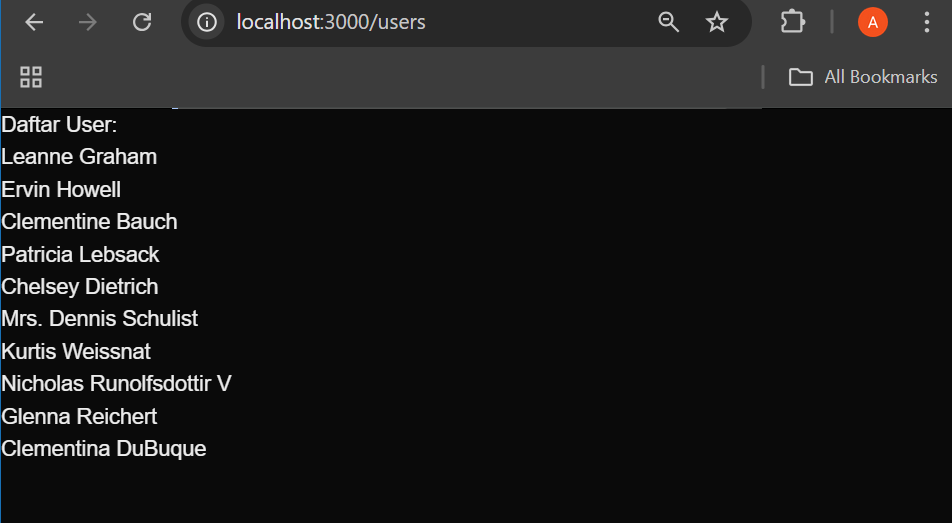

This is a [Next.js](https://nextjs.org) project bootstrapped with [`create-next-app`](https://nextjs.org/docs/pages/api-reference/create-next-app).

## Getting Started

First, run the development server:

```bash
npm run dev
# or
yarn dev
# or
pnpm dev
# or
bun dev
```

Open [http://localhost:3000](http://localhost:3000) with your browser to see the result.

You can start editing the page by modifying `pages/index.tsx`. The page auto-updates as you edit the file.

[API routes](https://nextjs.org/docs/pages/building-your-application/routing/api-routes) can be accessed on [http://localhost:3000/api/hello](http://localhost:3000/api/hello). This endpoint can be edited in `pages/api/hello.ts`.

The `pages/api` directory is mapped to `/api/*`. Files in this directory are treated as [API routes](https://nextjs.org/docs/pages/building-your-application/routing/api-routes) instead of React pages.

This project uses [`next/font`](https://nextjs.org/docs/pages/building-your-application/optimizing/fonts) to automatically optimize and load [Geist](https://vercel.com/font), a new font family for Vercel.

# -03-Praktikum-3-Pengenalan Next.js
## Laporan Praktikum

|  | Pemrograman Berbasis Framework 2025 |
|--|--|
| NIM |  2241720115|
| Nama |  Alhamdana Fariz Al Furqaan |
| Kelas | TI - 3B |

## Langkah-langkah Praktikum
1. Persiapan Lingkungan
2. Membuat Halaman dengan Server-Side Rendering (SSR)

3. Menggunakan Static Site Generation (SSG)

4. Menggunakan Dynamic Routes

5. Menggunakan API Routes

6. Menggunakan Link Component


## Tugas
1. Buat halaman baru dengan menggunakan Static Site Generation (SSG) yang menampilkan daftar
pengguna dari API https://jsonplaceholder.typicode.com/users.
- \api\users.js
```javascript
async function handler(req, res) {
    const response = await fetch('https://jsonplaceholder.typicode.com/users');
    const users = await response.json();
    
    res.status(200).json(users);
}
export default handler;
```
- \user\[id].js
```javascript
import { useRouter } from "next/router";
import React from "react";
import Link from "next/link";

const UserProfile = ({ user }) => {
  const router = useRouter();
  return (
    <div>
      <h1>User Profile</h1>
      <p>Nama: {user.name}</p>
      <p>Email: {user.email}</p>
      <p>Email: {user.phone}</p>
      <p>Email: {user.website}</p>
      <Link href="/users">Kembali ke daftar user</Link>
    </div>
  );
};

export async function getStaticPaths() {
  const res = await fetch("https://jsonplaceholder.typicode.com/users");
  const users = await res.json();
  const paths = users.map((user) => ({
    params: { id: user.id.toString() },
  }));
  return {
    paths,
    fallback: false,
  };
}
export async function getStaticProps({ params }) {
  const res = await fetch(
    `https://jsonplaceholder.typicode.com/users/${params.id}`
  );
  const user = await res.json();

  return {
    props: {
      user
    },
  };
}

export default UserProfile;
```
- users.js
```javascript
import Link from "next/link";
import { useEffect, useState } from "react";

const UsersList = () => {
  const [users, setUsers] = useState([]);

  useEffect(() => {
    const fetchUsers = async () => {
      const response = await fetch("api/users");
      const users = await response.json();
      setUsers(users);
    };
    fetchUsers();
  }, []);
  return (
    <div>
      <h1>Daftar User:</h1>
      <ul>
        {users.map((user) => (
          <Link href="/user/[id]" as={`/user/${user.id}`}>
            <li key={user.id}>{user.name}</li>
          </Link>
        ))}
      </ul>
    </div>
  );
};
export default UsersList;
```
### Hasil Tampilan

2. Implementasikan Dynamic Routes untuk menampilkan detail pengguna berdasarkan ID.
- user\[id].js
```javascript
import { useRouter } from "next/router";
import React from "react";
import Link from "next/link";

const UserProfile = ({ user }) => {
  const router = useRouter();
  return (
    <div>
      <h1>User Profile</h1>
      <p>Nama: {user.name}</p>
      <p>Email: {user.email}</p>
      <p>Email: {user.phone}</p>
      <p>Email: {user.website}</p>
      <Link href="/users">Kembali ke daftar user</Link>
    </div>
  );
};

export async function getStaticPaths() {
  const res = await fetch("https://jsonplaceholder.typicode.com/users");
  const users = await res.json();
  const paths = users.map((user) => ({
    params: { id: user.id.toString() },
  }));
  return {
    paths,
    fallback: false,
  };
}
export async function getStaticProps({ params }) {
  const res = await fetch(
    `https://jsonplaceholder.typicode.com/users/${params.id}`
  );
  const user = await res.json();

  return {
    props: {
      user
    },
  };
}

export default UserProfile;
```

- api/users.js
```javascript
async function handler(req, res) {
    const response = await fetch('https://jsonplaceholder.typicode.com/users');
    const users = await response.json();
    
    res.status(200).json(users);
}
export default handler;
```
- users.js
```javascript
import Link from "next/link";
import { useEffect, useState } from "react";

const UsersList = () => {
  const [users, setUsers] = useState([]);

  useEffect(() => {
    const fetchUsers = async () => {
      const response = await fetch("api/users");
      const users = await response.json();
      setUsers(users);
    };
    fetchUsers();
  }, []);
  return (
    <div>
      <h1>Daftar User:</h1>
      <ul>
        {users.map((user) => (
          <Link href="/user/[id]" as={`/user/${user.id}`}>
            <li key={user.id}>{user.name}</li>
          </Link>
        ))}
      </ul>
    </div>
  );
};
export default UsersList;
```
### Hasil Tampilan

3. Buat API route yang mengembalikan data cuaca dari API eksternal (misalnya,
OpenWeatherMap) dan tampilkan data tersebut di halaman front-end.
- api/weather.js
```javascript
export default async function handler(req, res) {
    const { city } = req.query;
    const API_KEY = process.env.OPENWEATHER_API_KEY;
    const URL = `https://api.openweathermap.org/data/2.5/weather?q=${city}&appid=${API_KEY}&units=metric`;
  
    try {
      const response = await fetch(URL);
      if (!response.ok) throw new Error("Gagal mengambil data cuaca");
  
      const data = await response.json();
      res.status(200).json({
        city: data.name,
        temperature: data.main.temp,
        description: data.weather[0].description,
        icon: `https://openweathermap.org/img/wn/${data.weather[0].icon}.png`,
      });
    } catch (error) {
      res.status(500).json({ error: error.message });
    }
  }
```
- weather.js
```javascript
import { useState } from "react";

const Weather = () => {
  const [city, setCity] = useState("");
  const [weather, setWeather] = useState(null);
  const [loading, setLoading] = useState(false);
  const [error, setError] = useState("");

  const fetchWeather = async () => {
    setLoading(true);
    setError("");
    setWeather(null);

    try {
      const response = await fetch(`/api/weather?city=${city}`);
      const data = await response.json();

      if (response.ok) {
        setWeather(data);
      } else {
        throw new Error(data.error || "Gagal mengambil data cuaca");
      }
    } catch (err) {
      setError(err.message);
    }

    setLoading(false);
  };

  return (
    <div>
      <input
        type="text"
        placeholder="Masukkan nama kota"
        value={city}
        onChange={(e) => setCity(e.target.value)}
      />
      <button onClick={fetchWeather}>Cek Cuaca</button>

      {loading && <p>Loading...</p>}
      {error && <p style={{ color: "red" }}>{error}</p>}

      {weather && (
        <div>
          <h2>{weather.city}</h2>
          <p>{weather.temperature}°C</p>
          <p>{weather.description}</p>
          
        </div>
      )}
    </div>
  );
};

export default Weather;
```
### Hasil Tampilan
