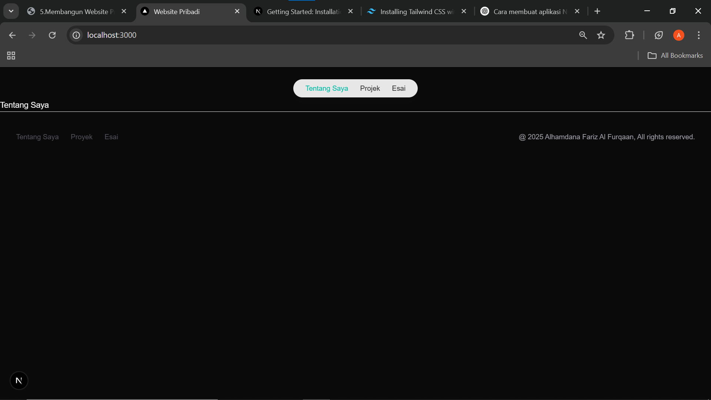
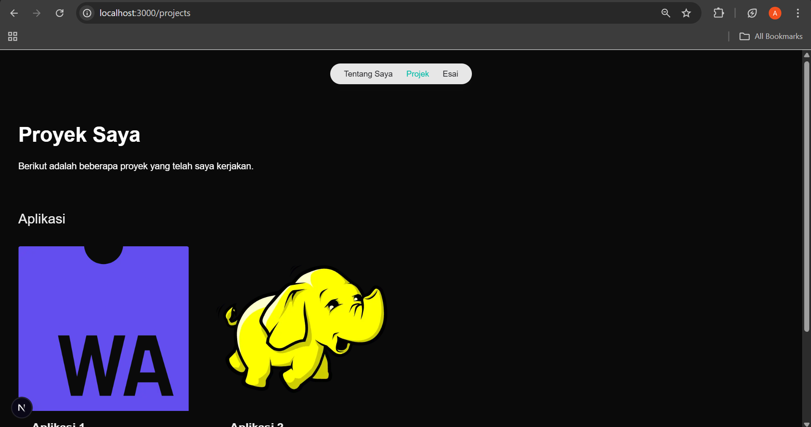
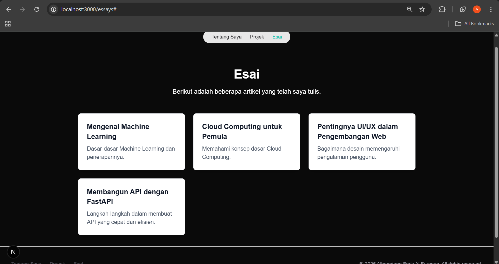
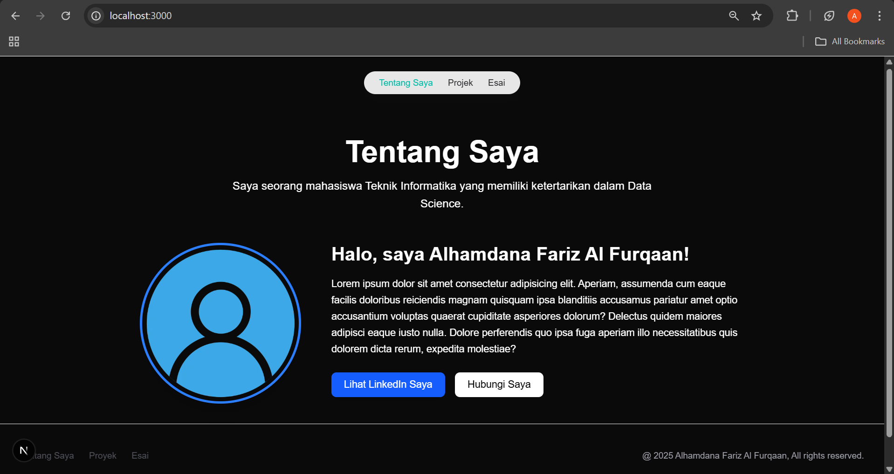

This is a [Next.js](https://nextjs.org) project bootstrapped with [`create-next-app`](https://nextjs.org/docs/app/api-reference/cli/create-next-app).

## Getting Started

First, run the development server:

```bash
npm run dev
# or
yarn dev
# or
pnpm dev
# or
bun dev
```

Open [http://localhost:3000](http://localhost:3000) with your browser to see the result.

# -05-Membangun Website Pribadi dengan Next.js 
## Laporan Praktikum

|  | Pemrograman Berbasis Framework 2025 |
|--|--|
| NIM |  2241720115|
| Nama |  Alhamdana Fariz Al Furqaan |
| Kelas | TI - 3B |

## Langkah-langkah Praktikum
1. Persiapan Lingkungan
2. Membuat Halaman Website
3. Membuat Layout dan Navigasi


4. Membuat Halaman Proyek dengan Grid Responsif



## Tugas
Tugas
Eksplorasi Tailwindcss, kemudian.
1. Modifikasi halaman "Esai" dengan Grid daftar artikel yang telah ditulis.
### essays\page.tsx
```javascript
import React from 'react'
import {Inter} from 'next/font/google';
import { Metadata } from 'next';

const inter = Inter({subsets: ['latin']})
export const metadata: Metadata = {
  title: 'Website Pribadi',
  description: 'Website pribadi untuk menampilkan proyek dan esai.',
  openGraph: {
    title: "Website Pribadi",
    description: "Halaman esai.",
  },
}
export default function Page() {
  const articles = [
    { title: "Mengenal Machine Learning", description: "Dasar-dasar Machine Learning dan penerapannya.", link: "#" },
    { title: "Cloud Computing untuk Pemula", description: "Memahami konsep dasar Cloud Computing.", link: "#" },
    { title: "Pentingnya UI/UX dalam Pengembangan Web", description: "Bagaimana desain memengaruhi pengalaman pengguna.", link: "#" },
    { title: "Membangun API dengan FastAPI", description: "Langkah-langkah dalam membuat API yang cepat dan efisien.", link: "#" }
  ];

  return (
    <div className="mt-16 px-8 max-w-5xl mx-auto text-white">
      <header className="text-center">
        <h1 className="font-bold text-4xl">Esai</h1>
        <p className="text-lg mt-4 text-white">Berikut adalah beberapa artikel yang telah saya tulis.</p>
      </header>
      
      <div className="mt-12 grid grid-cols-1 sm:grid-cols-2 md:grid-cols-3 gap-6 mb-8">
        {articles.map((article, index) => (
          <a
            key={index}
            href={article.link}
            className="block bg-white p-6 rounded-lg shadow-lg hover:shadow-xl transition border border-gray-200"
          >
            <h2 className="text-xl font-semibold text-gray-900">{article.title}</h2>
            <p className="text-gray-600 mt-2">{article.description}</p>
          </a>
        ))}
      </div>
    </div>
  );
}
```
- Tampilan

2. Modifikasi halaman “Tentang Saya” Buat tampilan yang menarik
### Page.tsx
``` javascript
import Image from "next/image";

export const metadata = {
  title: "Website Pribadi",
  description: "Halaman tentang saya.",
  openGraph: {
    title: "Tentang Saya",
    description: "Halaman tentang saya.",
  },
};

export default function Home() {
  return (
    <div className="mt-16 px-8 max-w-5xl mx-auto text-white">
      <header className="text-center">
        <h1 className="font-bold text-5xl">Tentang Saya</h1>
        <p className="text-lg mt-4 text-white max-w-2xl mx-auto">
          Saya seorang mahasiswa Teknik Informatika yang memiliki ketertarikan dalam Data Science.
        </p>
      </header>

      <div className="mt-12 flex flex-col md:flex-row items-center md:items-start gap-12 mb-8">
        <div className="relative w-56 h-56 md:w-64 md:h-64">
          <Image
            className="rounded-full shadow-xl border-4 border-blue-500"
            src="/images/profile.png"
            alt="Profile Picture"
            layout="fill"
            objectFit="cover"
          />
        </div>
        <div className="flex-1">
          <h2 className="text-3xl font-semibold">Halo, saya Alhamdana Fariz Al Furqaan!</h2>
          <p className="text-white mt-4 leading-relaxed">
            Lorem ipsum dolor sit amet consectetur adipisicing elit. Aperiam, assumenda cum eaque facilis doloribus reiciendis magnam quisquam ipsa blanditiis accusamus pariatur amet optio accusantium voluptas quaerat cupiditate asperiores dolorum? Delectus quidem maiores adipisci eaque iusto nulla. Dolore perferendis quo ipsa fuga aperiam illo necessitatibus quis dolorem dicta rerum, expedita molestiae?
          </p>
          <div className="mt-6 flex gap-4">
            <a
              href=""
              className="bg-blue-600 text-white px-5 py-2 rounded-lg shadow-lg hover:bg-blue-700 transition font-medium"
              rel="noopener noreferrer"
            >
              Lihat LinkedIn Saya
            </a>
            <a
              href=""
              className="bg-white text-black px-5 py-2 rounded-lg shadow hover:bg-gray-300 transition font-medium"
            >
              Hubungi Saya
            </a>
          </div>
        </div>
      </div>
    </div>
  );
}
```
- Tampilan
