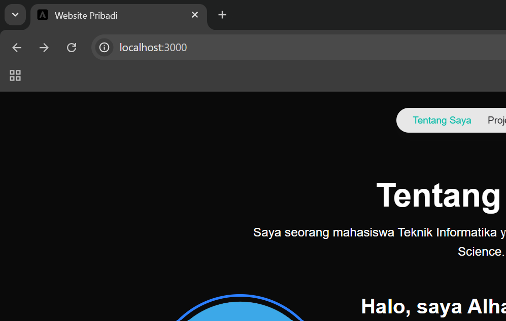
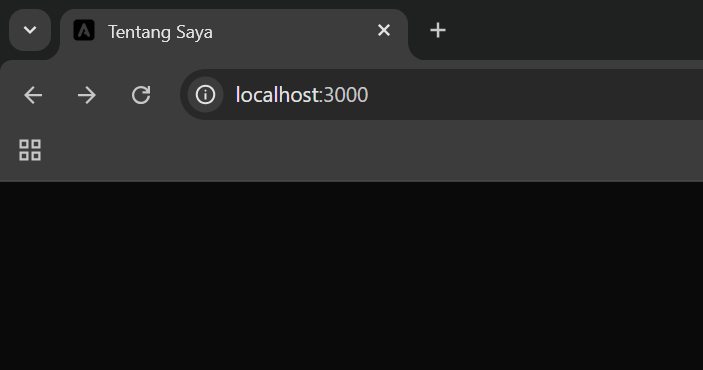
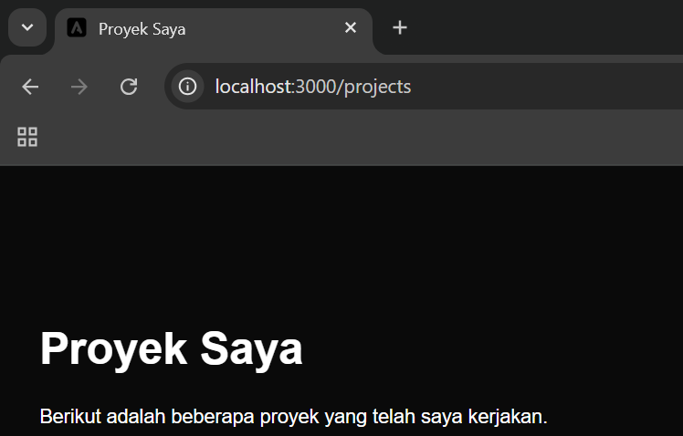
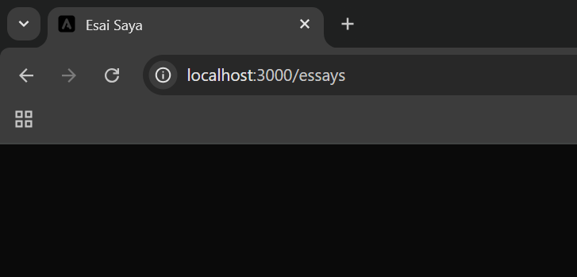
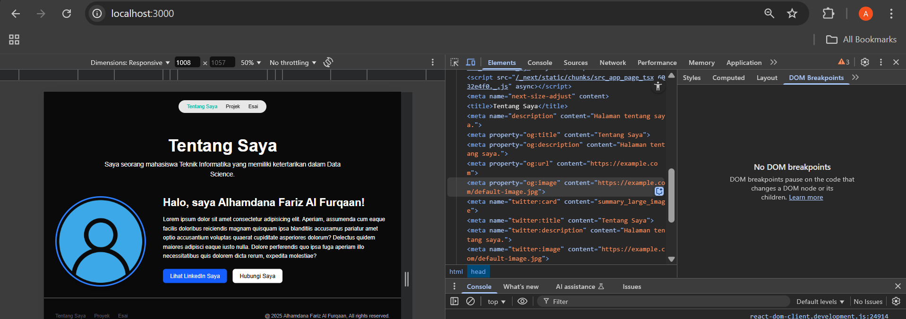
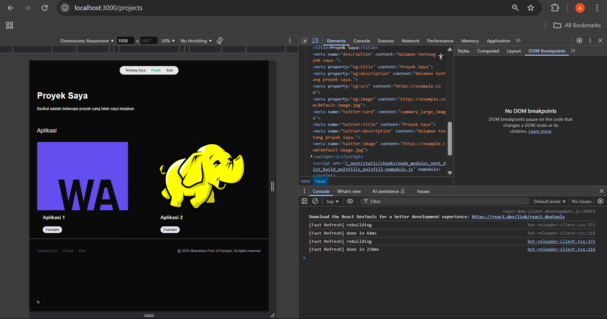
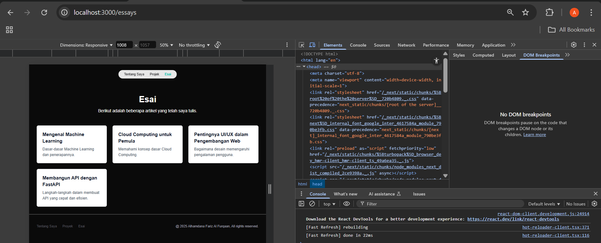
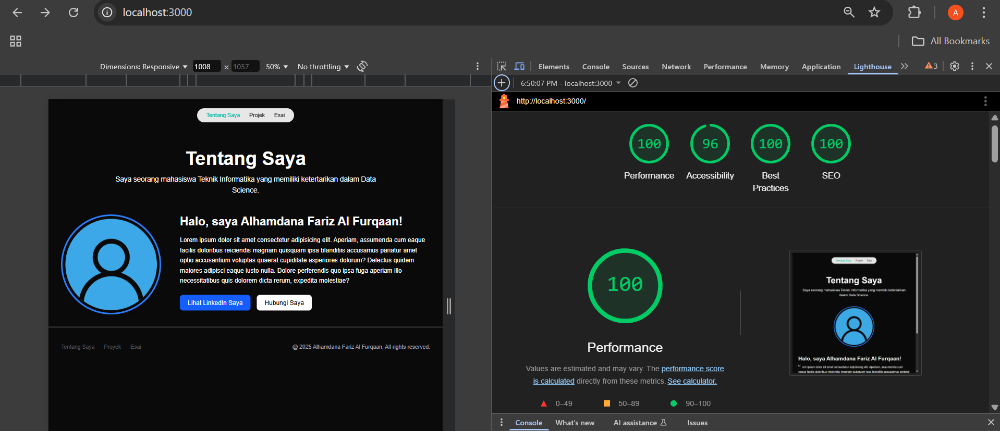
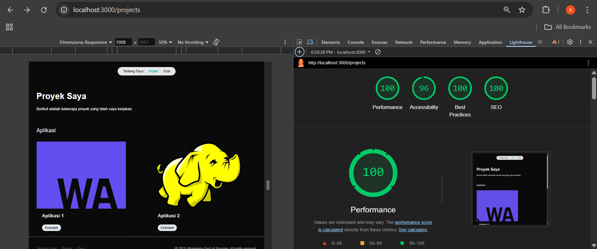
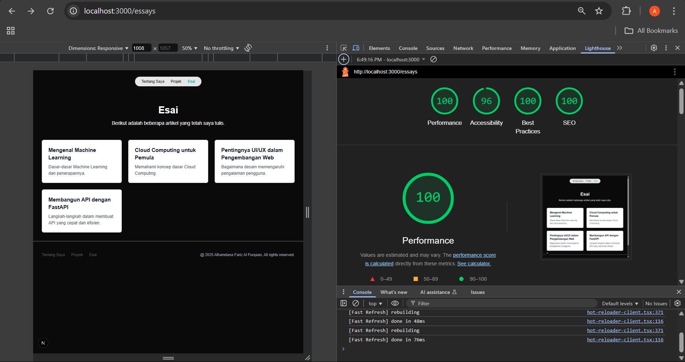

This is a [Next.js](https://nextjs.org) project bootstrapped with [`create-next-app`](https://nextjs.org/docs/app/api-reference/cli/create-next-app).

## Getting Started

First, run the development server:

```bash
npm run dev
# or
yarn dev
# or
pnpm dev
# or
bun dev
```

Open [http://localhost:3000](http://localhost:3000) with your browser to see the result.

# -10-Membuat Halaman yang SEO-Friendly 
## Laporan Praktikum

|  | Pemrograman Berbasis Framework 2025 |
|--|--|
| NIM |  2241720115|
| Nama |  Alhamdana Fariz Al Furqaan |
| Kelas | TI - 3B |

## Langkah-langkah Praktikum
1. Memahami Pentingnya SEO
2. Menambahkan Favicon\
a. Siapkan file favicon (format .ico) dan letakkan di folder public/.\
\
b. Hapus faveicon.ico yang ada di folder src/app\
c. Update file src/components/layout.tsx untuk menambahkan favicon:
```typescript
export default function Layout({ children }: LayoutProps) {
  return (
    <>
      <Head>
        <link rel="icon" href="/favicon.ico" />
      </Head>
      <Navbar />
      <main>{children}</main>
      <Footer />
    </>
  );
}
```
d. Simpan dan jalankan proyek. Favicon akan muncul di tab browser.


3. Menambahkan Metadata untuk SEO
a.	Buat file src/utils/metadata.ts untuk menyimpan metadata default:
```typescript
export const defaultMetadata = {
  title: "Website Pribadi",
  description: "Website pribadi untuk menampilkan proyek dan esai.",
  openGraph: {
    images: "https://example.com/default-image.jpg",
    url: "https://example.com"
  },
};
```
b.	Update file src/components/layout.tsx untuk menggunakan metadata default jika tidak ada metadata yang di-pass:
```typescript
export default function Layout({ children }: any) {
  const metadata = children.props.metadata|| defaultMetadata;
  return (
    <>
      <Head>
        <link rel="icon" href="/favicon.ico" />
        <title>{metadata.title}</title>
        <meta name="description" content={metadata.description} />
        <meta property="og:title" content={metadata.title} />
        <meta property="og:description" content={metadata.description} />
        <meta property="og:image" content={metadata.openGraph.images} />
        <meta property="og:url" content={metadata.openGraph.url} />
      </Head>
      <Navbar />
      <main>{children}</main>
      <Footer />
    </>
  );
}
```
c.	Update Setiap Halaman untuk dapat mem-pass definisi metadata
- Halaman tentang saya

- Halaman Project saya

- Halaman Esai saya


5.  Open Graph Tags untuk Media Sosial & Menguji SEO
- Halaman tentang saya

- Halaman Project saya

- Halaman Esai saya


## Tugas
Lakukan pengujian SEO dengan
1.	Gunakan tools seperti Google Search Console untuk memeriksa performa SEO dari suatu website.\
`*` Pada bagian ini saya menggunakan lighthouse untuk mengukur performa SEO.
- SEO Halaman tentang saya

- SEO Halaman Project saya

- SEO Halaman Esai saya

